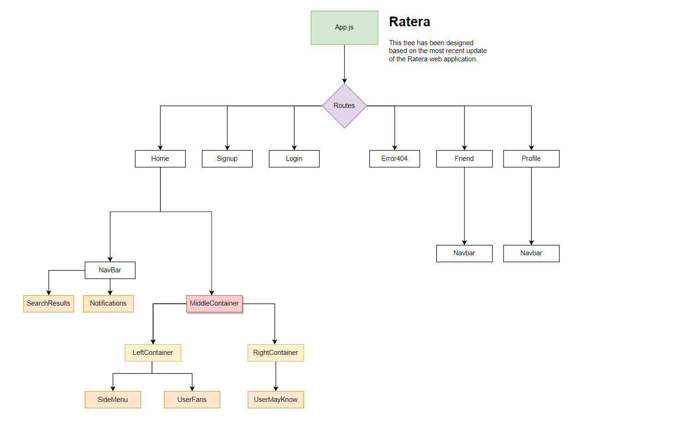

# Ratera

Type: Social Media Rating App

About:

Ratera: Elevate your Social Rating! 🌟

Ratera is a unique social media app that revolutionizes the way we interact online. It's not just about likes and shares – here, you can rate others based on their characteristics like loyalty, helpfulness, kindness, and politeness. Encouraging positivity and growth, Ratera inspires a friendly environment where users can learn from one another. Join the community and experience the power of constructive feedback today! 🚀

Colors used - [view-colors](https://coolors.co/e5f9e0-5e807f-111111-0e131f-cfdee7 "https://coolors.co/e5f9e0-5e807f-111111-0e131f-cfdee7")

Component Tree: [view-updated-tree-structure](https://viewer.diagrams.net/?tags=%7B%7D&highlight=0000ff&edit=_blank&layers=1&nav=1&title=Untitled%20Diagram.drawio#Uhttps%3A%2F%2Fdrive.google.com%2Fuc%3Fid%3D1QF3qiWRsRmUNVavfvGB7HTJxH0inFDq1%26export%3Ddownload "component tree of ratera")

